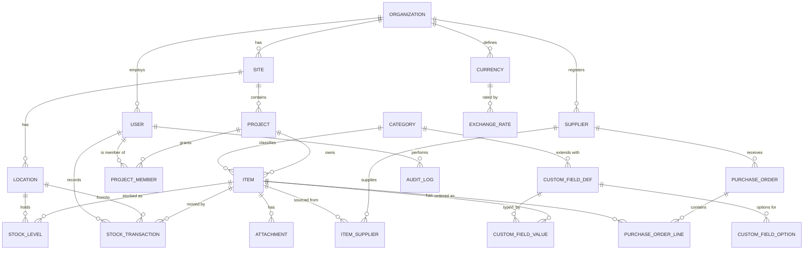

# Database Design & ER Diagram
## Inventory Management System (IMS)

**Database:** PostgreSQL 15+
**Version:** 1.0
**Companion to:** `01_PRD.md`

---

## 1. Design principles

- **Normalized core** with a flexible custom-fields layer for extensibility.
- **Stock balance is derived**, never stored as an editable column. On-hand = sum of `stock_transactions.quantity_delta` per item/location. A `stock_levels` table is kept as a **materialized cache** updated atomically by triggers for fast reads.
- **Immutable ledger:** `stock_transactions` rows are insert-only. Corrections are new reversing rows.
- **Soft deletes** via `deleted_at` on master tables; no hard deletes of items/transactions.
- **Multi-tenant by organization**, scoped by project for access control.
- **UUID primary keys** (`uuid_generate_v4()` / `gen_random_uuid()`), `created_at` / `updated_at` on all tables.
- **Custom fields** use a hybrid model: definitions in `custom_field_defs`, values in `custom_field_values` (EAV), with a `jsonb` fallback column on `items` for fast filtering.

---

## 2. Entity-Relationship Diagram (Mermaid)



---

## 3. Table definitions (PostgreSQL DDL)

### 3.1 Tenancy, identity & access

> **As-built (reconciled 2026-06-14).** The DDL below reflects the schema after
> migrations `001`–`006` (`backend/migrations/`). Key deltas from the original
> v1 design: login is by **`username`** (email is optional, encrypted contact
> PII — no longer `CITEXT UNIQUE`); organizations gained `is_active` and
> `require_user_approval`; users gained `self_registered` and `approval_status`;
> and three tables were added — `refresh_tokens`, `platform_admins`, `txn_labels`
> (§3.6a). See §3.9 for the column-level encryption convention.

```sql
CREATE EXTENSION IF NOT EXISTS "pgcrypto";        -- gen_random_uuid()
CREATE EXTENSION IF NOT EXISTS "pg_trgm";         -- fast text search
CREATE EXTENSION IF NOT EXISTS "citext";          -- case-insensitive username

CREATE TABLE organizations (
    id                    UUID PRIMARY KEY DEFAULT gen_random_uuid(),
    name                  TEXT NOT NULL,
    base_currency         CHAR(3) NOT NULL DEFAULT 'USD',
    settings              JSONB NOT NULL DEFAULT '{}',
    is_active             BOOLEAN NOT NULL DEFAULT TRUE,   -- company on/off (platform admin)
    require_user_approval BOOLEAN NOT NULL DEFAULT TRUE,   -- gate self-registration
    created_at            TIMESTAMPTZ NOT NULL DEFAULT now(),
    updated_at            TIMESTAMPTZ NOT NULL DEFAULT now()
);

CREATE TABLE users (
    id              UUID PRIMARY KEY DEFAULT gen_random_uuid(),
    org_id          UUID NOT NULL REFERENCES organizations(id),
    username        CITEXT NOT NULL UNIQUE,            -- login identifier
    email           TEXT,                              -- optional, encrypted PII (§3.9)
    full_name       TEXT NOT NULL,
    password_hash   TEXT NOT NULL,                     -- bcrypt
    is_org_admin    BOOLEAN NOT NULL DEFAULT FALSE,
    is_active       BOOLEAN NOT NULL DEFAULT TRUE,
    self_registered BOOLEAN NOT NULL DEFAULT FALSE,
    approval_status TEXT NOT NULL DEFAULT 'approved'
        CHECK (approval_status IN ('pending','approved','rejected')),
    last_login_at   TIMESTAMPTZ,
    created_at      TIMESTAMPTZ NOT NULL DEFAULT now(),
    updated_at      TIMESTAMPTZ NOT NULL DEFAULT now(),
    deleted_at      TIMESTAMPTZ
);
CREATE INDEX idx_users_pending ON users(org_id) WHERE approval_status = 'pending';

-- Revocable refresh-token sessions (Redis-free substitute). Tokens are hashed.
CREATE TABLE refresh_tokens (
    id          UUID PRIMARY KEY DEFAULT gen_random_uuid(),
    user_id     UUID NOT NULL REFERENCES users(id),
    token_hash  TEXT NOT NULL,                         -- sha256 of the JWT
    expires_at  TIMESTAMPTZ NOT NULL,
    revoked_at  TIMESTAMPTZ,
    created_at  TIMESTAMPTZ NOT NULL DEFAULT now()
);
CREATE INDEX idx_refresh_user ON refresh_tokens(user_id);

-- Super-admins above all organizations (provision companies via /platform).
-- Bootstrapped from PLATFORM_ADMIN_USERNAME/_PASSWORD at API startup.
CREATE TABLE platform_admins (
    id            UUID PRIMARY KEY DEFAULT gen_random_uuid(),
    username      CITEXT NOT NULL UNIQUE,
    full_name     TEXT NOT NULL DEFAULT 'Platform Admin',
    password_hash TEXT NOT NULL,
    is_active     BOOLEAN NOT NULL DEFAULT TRUE,
    last_login_at TIMESTAMPTZ,
    created_at    TIMESTAMPTZ NOT NULL DEFAULT now()
);

-- Per-project role assignment (RBAC)
CREATE TYPE project_role AS ENUM ('manager', 'technician', 'viewer');

CREATE TABLE project_members (
    id          UUID PRIMARY KEY DEFAULT gen_random_uuid(),
    project_id  UUID NOT NULL REFERENCES projects(id),
    user_id     UUID NOT NULL REFERENCES users(id),
    role        project_role NOT NULL,
    created_at  TIMESTAMPTZ NOT NULL DEFAULT now(),
    UNIQUE (project_id, user_id)
);
```

### 3.2 Sites, projects & locations

```sql
CREATE TABLE sites (
    id          UUID PRIMARY KEY DEFAULT gen_random_uuid(),
    org_id      UUID NOT NULL REFERENCES organizations(id),
    code        TEXT NOT NULL,
    name        TEXT NOT NULL,
    address     TEXT,
    created_at  TIMESTAMPTZ NOT NULL DEFAULT now(),
    updated_at  TIMESTAMPTZ NOT NULL DEFAULT now(),
    deleted_at  TIMESTAMPTZ,
    UNIQUE (org_id, code)
);

CREATE TABLE projects (
    id          UUID PRIMARY KEY DEFAULT gen_random_uuid(),
    site_id     UUID NOT NULL REFERENCES sites(id),
    code        TEXT NOT NULL,            -- e.g. 'Maintenance-CNW'
    name        TEXT NOT NULL,
    description TEXT,
    settings    JSONB NOT NULL DEFAULT '{}',  -- negative-stock policy, thresholds
    is_active   BOOLEAN NOT NULL DEFAULT TRUE,
    created_at  TIMESTAMPTZ NOT NULL DEFAULT now(),
    updated_at  TIMESTAMPTZ NOT NULL DEFAULT now(),
    deleted_at  TIMESTAMPTZ,
    UNIQUE (site_id, code)
);

-- Fine-grained storage positions, e.g. "CNW L/L R1D"
CREATE TABLE locations (
    id          UUID PRIMARY KEY DEFAULT gen_random_uuid(),
    site_id     UUID NOT NULL REFERENCES sites(id),
    code        TEXT NOT NULL,            -- 'CNW L/L R1D'
    name        TEXT,
    parent_id   UUID REFERENCES locations(id),  -- optional hierarchy (zone>rack>bin)
    created_at  TIMESTAMPTZ NOT NULL DEFAULT now(),
    deleted_at  TIMESTAMPTZ,
    UNIQUE (site_id, code)
);
```

### 3.3 Catalog: categories, suppliers, currencies

```sql
CREATE TABLE categories (
    id          UUID PRIMARY KEY DEFAULT gen_random_uuid(),
    org_id      UUID NOT NULL REFERENCES organizations(id),
    name        TEXT NOT NULL,            -- 'Solenoid Valves', 'Sensors'
    parent_id   UUID REFERENCES categories(id),
    created_at  TIMESTAMPTZ NOT NULL DEFAULT now(),
    deleted_at  TIMESTAMPTZ,
    UNIQUE (org_id, name)
);

CREATE TABLE suppliers (
    id            UUID PRIMARY KEY DEFAULT gen_random_uuid(),
    org_id        UUID NOT NULL REFERENCES organizations(id),
    name          TEXT NOT NULL,          -- 'Burkert', 'VEGA'
    contact_name  TEXT,
    email         TEXT,
    phone         TEXT,
    lead_time_days INT,
    currency      CHAR(3),
    created_at    TIMESTAMPTZ NOT NULL DEFAULT now(),
    updated_at    TIMESTAMPTZ NOT NULL DEFAULT now(),
    deleted_at    TIMESTAMPTZ,
    UNIQUE (org_id, name)
);

CREATE TABLE currencies (
    code        CHAR(3) PRIMARY KEY,      -- 'USD','EUR','SGD','JPY','CNY'
    name        TEXT NOT NULL,
    symbol      TEXT
);

-- Effective-dated exchange rates -> base currency (replaces per-row Excel rates)
CREATE TABLE exchange_rates (
    id            UUID PRIMARY KEY DEFAULT gen_random_uuid(),
    org_id        UUID NOT NULL REFERENCES organizations(id),
    from_currency CHAR(3) NOT NULL REFERENCES currencies(code),
    to_currency   CHAR(3) NOT NULL REFERENCES currencies(code),
    rate          NUMERIC(18,8) NOT NULL,
    effective_date DATE NOT NULL,
    created_at    TIMESTAMPTZ NOT NULL DEFAULT now(),
    UNIQUE (org_id, from_currency, to_currency, effective_date)
);
```

### 3.4 Items (maps Excel fixed columns)

```sql
CREATE TYPE abc_class AS ENUM ('A','B','C');

CREATE TABLE items (
    id               UUID PRIMARY KEY DEFAULT gen_random_uuid(),
    project_id       UUID NOT NULL REFERENCES projects(id),
    category_id      UUID REFERENCES categories(id),
    item_no          TEXT NOT NULL,          -- Excel 'Item No' e.g. C4100050001
    description      TEXT NOT NULL,          -- Excel 'Description'
    specification    TEXT,                   -- Excel 'Specification'
    model            TEXT,                   -- Excel 'Model'
    supplier_id      UUID REFERENCES suppliers(id),  -- Excel 'Supplier'
    department       TEXT,                   -- Excel 'Department'
    default_location_id UUID REFERENCES locations(id), -- Excel 'Stock Location'
    unit_price       NUMERIC(18,4),          -- Excel 'Unit Price' (native currency)
    currency         CHAR(3) REFERENCES currencies(code),  -- Excel 'Currency'
    reorder_level    NUMERIC(18,3) DEFAULT 0,
    max_level        NUMERIC(18,3),
    abc_class        abc_class,
    barcode          TEXT,                   -- auto/scanned
    comments         TEXT,                   -- Excel 'Comments'
    custom           JSONB NOT NULL DEFAULT '{}',  -- fast-filter copy of custom values
    is_active        BOOLEAN NOT NULL DEFAULT TRUE,
    created_by       UUID REFERENCES users(id),
    created_at       TIMESTAMPTZ NOT NULL DEFAULT now(),
    updated_at       TIMESTAMPTZ NOT NULL DEFAULT now(),
    deleted_at       TIMESTAMPTZ,
    UNIQUE (project_id, item_no)
);

-- Derived/computed in queries: value = stock_on_hand * unit_price
-- amount_eur = value * exchange_rate(currency->EUR)

CREATE INDEX idx_items_project      ON items(project_id) WHERE deleted_at IS NULL;
CREATE INDEX idx_items_desc_trgm    ON items USING gin (description gin_trgm_ops);
CREATE INDEX idx_items_model_trgm   ON items USING gin (model gin_trgm_ops);
CREATE INDEX idx_items_custom_gin   ON items USING gin (custom);
CREATE INDEX idx_items_barcode      ON items(barcode);
```

### 3.5 Item–supplier (many-to-many) & attachments

```sql
CREATE TABLE item_suppliers (
    id            UUID PRIMARY KEY DEFAULT gen_random_uuid(),
    item_id       UUID NOT NULL REFERENCES items(id),
    supplier_id   UUID NOT NULL REFERENCES suppliers(id),
    supplier_part_no TEXT,
    price         NUMERIC(18,4),
    currency      CHAR(3) REFERENCES currencies(code),
    is_preferred  BOOLEAN NOT NULL DEFAULT FALSE,
    UNIQUE (item_id, supplier_id)
);

CREATE TABLE attachments (
    id          UUID PRIMARY KEY DEFAULT gen_random_uuid(),
    item_id     UUID NOT NULL REFERENCES items(id),
    file_name   TEXT NOT NULL,
    storage_key TEXT NOT NULL,           -- S3/MinIO object key
    mime_type   TEXT,
    size_bytes  BIGINT,
    uploaded_by UUID REFERENCES users(id),
    created_at  TIMESTAMPTZ NOT NULL DEFAULT now()
);
```

### 3.6 Stock levels (cache) & transactions (ledger)

```sql
-- Materialized on-hand per item+location. Maintained by trigger from ledger.
CREATE TABLE stock_levels (
    id            UUID PRIMARY KEY DEFAULT gen_random_uuid(),
    item_id       UUID NOT NULL REFERENCES items(id),
    location_id   UUID NOT NULL REFERENCES locations(id),
    quantity      NUMERIC(18,3) NOT NULL DEFAULT 0,
    updated_at    TIMESTAMPTZ NOT NULL DEFAULT now(),
    UNIQUE (item_id, location_id)
);

CREATE TYPE txn_type AS ENUM ('receipt','issue','adjustment','transfer','write_off','opening');

-- Immutable ledger. Each row replaces one Excel "Purpose & Date / Qty Change" pair.
CREATE TABLE stock_transactions (
    id              UUID PRIMARY KEY DEFAULT gen_random_uuid(),
    project_id      UUID NOT NULL REFERENCES projects(id),
    item_id         UUID NOT NULL REFERENCES items(id),
    type            txn_type NOT NULL,        -- base behaviour (drives the maths)
    label           TEXT,                     -- display label captured at movement time (§3.6a)
    quantity_delta  NUMERIC(18,3) NOT NULL,   -- +in / -out (Excel 'Qty Change')
    from_location_id UUID REFERENCES locations(id),  -- for issue/transfer
    to_location_id   UUID REFERENCES locations(id),  -- for receipt/transfer
    unit_price      NUMERIC(18,4),            -- price at time of movement
    currency        CHAR(3) REFERENCES currencies(code),
    purpose         TEXT,                     -- Excel 'Purpose & Date' note
    reference       TEXT,                     -- work order / PO number
    reverses_txn_id UUID REFERENCES stock_transactions(id),  -- correction link
    performed_by    UUID REFERENCES users(id),
    performed_at    TIMESTAMPTZ NOT NULL DEFAULT now(),
    created_at      TIMESTAMPTZ NOT NULL DEFAULT now()
    -- NO updated_at / deleted_at: ledger is append-only
);

CREATE INDEX idx_txn_item    ON stock_transactions(item_id, performed_at DESC);
CREATE INDEX idx_txn_project ON stock_transactions(project_id, performed_at DESC);
CREATE INDEX idx_txn_type    ON stock_transactions(type);
```

**Trigger to keep `stock_levels` in sync (as-built — `migrations/001_init.sql`):**

The implemented trigger special-cases `transfer` (which carries a positive
magnitude in `quantity_delta` and moves it from→to); for all other types it
applies the signed `quantity_delta` to whichever single location is set. Sign
conventions are enforced in the service layer (`routes/transactions.ts`):
`receipt`/`opening` `>0` to a `to_location`; `issue`/`write_off` `<0` from a
`from_location`; `adjustment` signed on its `to_location`.

```sql
CREATE OR REPLACE FUNCTION apply_stock_transaction() RETURNS TRIGGER AS $$
BEGIN
    IF NEW.type = 'transfer' THEN
        -- move magnitude from source to destination
        INSERT INTO stock_levels(item_id, location_id, quantity)
        VALUES (NEW.item_id, NEW.from_location_id, -NEW.quantity_delta)
        ON CONFLICT (item_id, location_id)
        DO UPDATE SET quantity = stock_levels.quantity - NEW.quantity_delta, updated_at = now();

        INSERT INTO stock_levels(item_id, location_id, quantity)
        VALUES (NEW.item_id, NEW.to_location_id, NEW.quantity_delta)
        ON CONFLICT (item_id, location_id)
        DO UPDATE SET quantity = stock_levels.quantity + NEW.quantity_delta, updated_at = now();
    ELSIF NEW.from_location_id IS NOT NULL THEN     -- issue / write_off (delta < 0)
        INSERT INTO stock_levels(item_id, location_id, quantity)
        VALUES (NEW.item_id, NEW.from_location_id, NEW.quantity_delta)
        ON CONFLICT (item_id, location_id)
        DO UPDATE SET quantity = stock_levels.quantity + NEW.quantity_delta, updated_at = now();
    ELSIF NEW.to_location_id IS NOT NULL THEN       -- receipt / opening / adjustment (signed)
        INSERT INTO stock_levels(item_id, location_id, quantity)
        VALUES (NEW.item_id, NEW.to_location_id, NEW.quantity_delta)
        ON CONFLICT (item_id, location_id)
        DO UPDATE SET quantity = stock_levels.quantity + NEW.quantity_delta, updated_at = now();
    END IF;
    RETURN NEW;
END;
$$ LANGUAGE plpgsql;

CREATE TRIGGER trg_apply_stock
AFTER INSERT ON stock_transactions
FOR EACH ROW EXECUTE FUNCTION apply_stock_transaction();
```

### 3.6a Movement labels (customizable transaction types)

```sql
-- Org-defined display labels, each mapped to one built-in txn_type behaviour.
-- The label text is copied onto each stock_transaction (stock_transactions.label)
-- so historical movements keep their wording even if the label is later changed.
CREATE TABLE txn_labels (
    id         UUID PRIMARY KEY DEFAULT gen_random_uuid(),
    org_id     UUID NOT NULL REFERENCES organizations(id),
    base_type  txn_type NOT NULL,        -- receipt|issue|transfer|adjustment|write_off
    label      TEXT NOT NULL,
    sort_order INT NOT NULL DEFAULT 0,
    is_active  BOOLEAN NOT NULL DEFAULT TRUE,
    created_at TIMESTAMPTZ NOT NULL DEFAULT now(),
    UNIQUE (org_id, label)
);
```

> The built-in set (Receipt/Issue/Transfer/Adjustment/Write-off) is seeded per
> organization at creation. `opening` has no label (system-generated).

### 3.7 Custom fields (admin-defined extensibility)

```sql
CREATE TYPE field_type AS ENUM ('text','number','date','boolean','select','multiselect');

CREATE TABLE custom_field_defs (
    id           UUID PRIMARY KEY DEFAULT gen_random_uuid(),
    org_id       UUID NOT NULL REFERENCES organizations(id),
    category_id  UUID REFERENCES categories(id),  -- NULL = applies to all items
    key          TEXT NOT NULL,            -- machine key, e.g. 'voltage'
    label        TEXT NOT NULL,            -- 'Voltage'
    type         field_type NOT NULL,
    is_required  BOOLEAN NOT NULL DEFAULT FALSE,
    default_value TEXT,
    help_text    TEXT,
    sort_order   INT NOT NULL DEFAULT 0,
    created_at   TIMESTAMPTZ NOT NULL DEFAULT now(),
    deleted_at   TIMESTAMPTZ,
    UNIQUE (org_id, category_id, key)
);

CREATE TABLE custom_field_options (   -- for select / multiselect
    id        UUID PRIMARY KEY DEFAULT gen_random_uuid(),
    field_id  UUID NOT NULL REFERENCES custom_field_defs(id),
    value     TEXT NOT NULL,
    label     TEXT NOT NULL,
    sort_order INT NOT NULL DEFAULT 0
);

CREATE TABLE custom_field_values (    -- EAV store
    id        UUID PRIMARY KEY DEFAULT gen_random_uuid(),
    item_id   UUID NOT NULL REFERENCES items(id),
    field_id  UUID NOT NULL REFERENCES custom_field_defs(id),
    value_text TEXT,
    value_num  NUMERIC(18,4),
    value_date DATE,
    value_bool BOOLEAN,
    UNIQUE (item_id, field_id)
);
```

> The `items.custom` JSONB column is a denormalized mirror of `custom_field_values` written on save, giving fast `WHERE custom @> '{"voltage":"24"}'` filtering while EAV preserves typed integrity and reporting.

### 3.8 Purchasing (lightweight) & audit

```sql
CREATE TYPE po_status AS ENUM ('draft','ordered','partial','received','cancelled');

CREATE TABLE purchase_orders (
    id          UUID PRIMARY KEY DEFAULT gen_random_uuid(),
    project_id  UUID NOT NULL REFERENCES projects(id),
    supplier_id UUID NOT NULL REFERENCES suppliers(id),
    po_number   TEXT NOT NULL,
    status      po_status NOT NULL DEFAULT 'draft',
    currency    CHAR(3) REFERENCES currencies(code),
    ordered_at  DATE,
    expected_at DATE,
    created_by  UUID REFERENCES users(id),
    created_at  TIMESTAMPTZ NOT NULL DEFAULT now(),
    updated_at  TIMESTAMPTZ NOT NULL DEFAULT now(),
    UNIQUE (project_id, po_number)
);

CREATE TABLE purchase_order_lines (
    id          UUID PRIMARY KEY DEFAULT gen_random_uuid(),
    po_id       UUID NOT NULL REFERENCES purchase_orders(id),
    item_id     UUID NOT NULL REFERENCES items(id),
    qty_ordered NUMERIC(18,3) NOT NULL,
    qty_received NUMERIC(18,3) NOT NULL DEFAULT 0,
    unit_price  NUMERIC(18,4)
);

CREATE TABLE audit_logs (
    id          UUID PRIMARY KEY DEFAULT gen_random_uuid(),
    org_id      UUID NOT NULL REFERENCES organizations(id),
    user_id     UUID REFERENCES users(id),
    action      TEXT NOT NULL,            -- 'item.update','txn.create', etc.
    entity_type TEXT NOT NULL,
    entity_id   UUID,
    before      JSONB,
    after       JSONB,
    ip_address  INET,
    created_at  TIMESTAMPTZ NOT NULL DEFAULT now()
);

CREATE INDEX idx_audit_entity ON audit_logs(entity_type, entity_id);
CREATE INDEX idx_audit_user   ON audit_logs(user_id, created_at DESC);
```

> **As-built:** purchase-order tables exist but no routes are mounted (PO flow is
> deferred — see `04_API.md` §10).

### 3.9 Column-level PII encryption (at rest)

Sensitive contact PII is encrypted by the application (AES-256-GCM) before it
reaches PostgreSQL, so DB files and backups only ever hold ciphertext for these
fields. No DDL type beyond `TEXT` is needed — values are stored in the format
`enc:v1:<base64(iv|tag|ciphertext)>`; legacy plaintext and a no-key deployment
both pass through unchanged on read, so the feature can be rolled out incrementally.

| Table.column | Encrypted |
|---|---|
| `users.email` | yes (login is by `username`, so `email` lost its `CITEXT UNIQUE` in `006`) |
| `suppliers.contact_name`, `suppliers.email`, `suppliers.phone` | yes |

The key lives only in the app env (`FIELD_ENCRYPTION_KEY`, 32 bytes / 64 hex) — a
separate trust domain from the database. Audit `before`/`after` snapshots capture
the already-encrypted column values.

---

## 4. Key derived views

```sql
-- On-hand per item across all locations
CREATE VIEW v_item_stock AS
SELECT i.id AS item_id, i.project_id,
       COALESCE(SUM(sl.quantity), 0) AS stock_on_hand
FROM items i
LEFT JOIN stock_levels sl ON sl.item_id = i.id
WHERE i.deleted_at IS NULL
GROUP BY i.id;

-- Valuation in native + base currency
CREATE VIEW v_item_valuation AS
SELECT i.id AS item_id, i.item_no, i.description,
       s.stock_on_hand,
       i.unit_price, i.currency,
       (s.stock_on_hand * i.unit_price) AS value_native
FROM items i
JOIN v_item_stock s ON s.item_id = i.id;

-- Reorder / low-stock flag
CREATE VIEW v_reorder AS
SELECT i.id AS item_id, i.item_no, i.description,
       s.stock_on_hand, i.reorder_level
FROM items i
JOIN v_item_stock s ON s.item_id = i.id
WHERE s.stock_on_hand <= i.reorder_level
  AND i.is_active AND i.deleted_at IS NULL;
```

---

## 5. Excel → schema field mapping

| Excel column | Maps to |
|---|---|
| Item No | `items.item_no` |
| Description | `items.description` |
| Specification | `items.specification` |
| Model | `items.model` |
| Supplier | `suppliers.name` → `items.supplier_id` |
| Department | `items.department` |
| Stock Location | `locations.code` → `items.default_location_id` |
| Stock Balance | **derived** via `v_item_stock` / `stock_levels` |
| Unit Price | `items.unit_price` |
| Currency | `items.currency` → `currencies` |
| Value / Amount | **computed** in `v_item_valuation` |
| Unit Price EUR / Amount in EUR | **computed** via `exchange_rates` |
| Comments | `items.comments` |
| Purpose & Date (each) | `stock_transactions.purpose` + `performed_at` |
| Qty Change (each) | `stock_transactions.quantity_delta` |
| 1 USD / 1 EUR rate cells | `exchange_rates` |

---

## 6. Indexing & performance notes
- Trigram GIN indexes on `description`/`model` power fuzzy search.
- GIN index on `items.custom` powers custom-field filtering.
- Composite `(item_id, performed_at DESC)` on the ledger powers per-item history.
- Partition `stock_transactions` by year (range) once volume exceeds a few million rows.
- `stock_levels` cache avoids summing the ledger on every list view.
